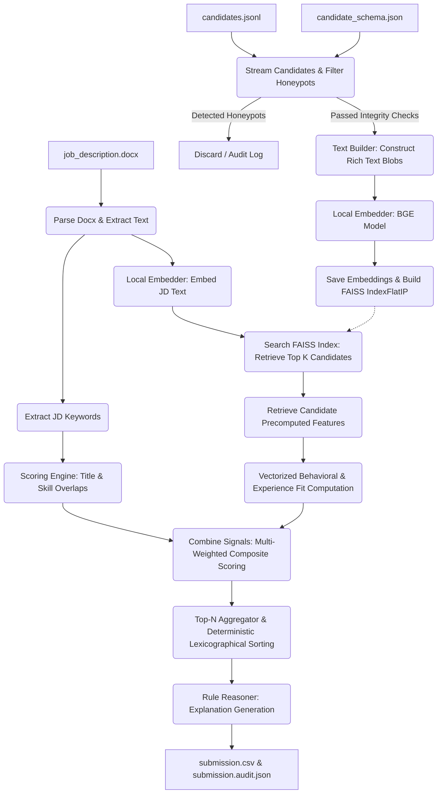
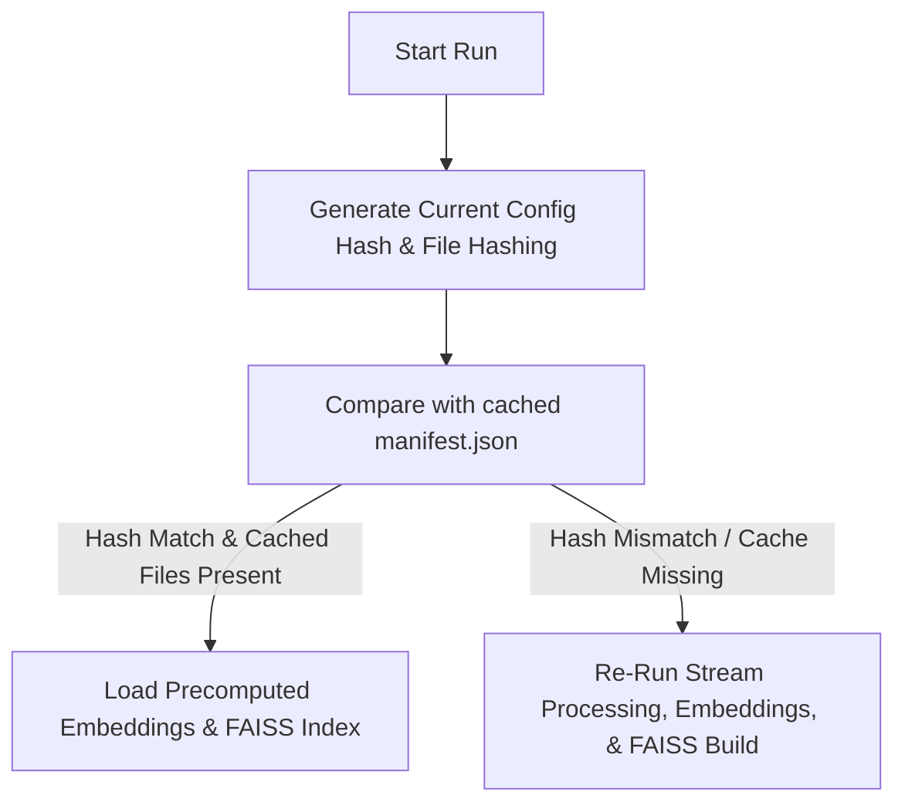

# Resume Ranker: Complete System Documentation

Welcome to the comprehensive technical documentation for the **Resume Ranker** system. This system is a production-grade, offline-first candidate matching and ranking platform designed to process, score, and rank large candidate pools (100,000+ profiles) against a job description (JD). It leverages semantic retrieval, deterministic behavioral signal aggregation, experience fit checks, anti-gaming logic, and static explainability rules to output a reproducible top-N candidate recommendation.

---

## 📖 Table of Contents
1. [Overview & Core Value Proposition](#1-overview--core-value-proposition)
2. [System Architecture & End-to-End Workflow](#2-system-architecture--end-to-end-workflow)
3. [Project Directory & File Structure](#3-project-directory--file-structure)
4. [Domain Scoring Methodology & Rules](#4-domain-scoring-methodology--rules)
5. [Honeypot Detection & Profile Integrity Checks](#5-honeypot-detection--profile-integrity-checks)
6. [Explainability Model & Logic](#6-explainability-model--logic)
7. [Infrastructure & Data Operations](#7-infrastructure--data-operations)
8. [CLI Tooling & Streamlit User Interface](#8-cli-tooling--streamlit-user-interface)
9. [Verification & Testing Strategy](#9-verification--testing-strategy)
10. [Setup & Running Instructions](#10-setup--running-instructions)

---

## 1. Overview & Core Value Proposition

The Resume Ranker is built to solve the limitations of standard Applicant Tracking Systems (ATS) and heavy cloud-based LLM architectures. Traditional systems rely on fragile keyword matching or expensive API calls with non-deterministic behavior.

### Primary Goals
*   **Offline-First & CPU-Bound**: Operates fully locally, removing network latency, API costs, and dependency on high-end GPUs.
*   **High Performance**: Employs FAISS (Facebook AI Similarity Search) and `orjson` streaming to retrieve candidate matches in milliseconds and process 100,000+ candidates in minutes.
*   **Reproducibility**: Guarantees identical outputs for identical inputs by tying rankings to a strict sorting hierarchy and maintaining configuration manifests.
*   **Anti-Gaming & Profile Integrity**: Discards impossible synthetic profiles and penalizes artificial keyword stuffing.
*   **Transparent Decision Making**: Explains final ratings via grounded rule-based text snippets rather than LLM-based hallucinated summaries.

---

## 2. System Architecture & End-to-End Workflow

The system is structured as a **two-stage hybrid search and re-ranking pipeline**. 

### Workflow Architecture
Below is the end-to-end data flow visualization:



### Stage 1: Precomputation
1.  **Candidate Ingestion**: [stream_candidates](file:///c:/Users/Aditya%20Kanamadi/projects/hackthon-projects/resume-ranker/src/resume_ranker/infrastructure/candidate_reader.py#L28) streams candidate records line-by-line from `candidates.jsonl`.
2.  **Honeypot Filtering**: Each profile is checked against 7 deterministic integrity filters in [detect](file:///c:/Users/Aditya%20Kanamadi/projects/hackthon-projects/resume-ranker/src/resume_ranker/domain/honeypot_rules.py#L134). If a rule fails, the profile is excluded.
3.  **Feature Processing**: Behavioral metrics are converted into normalized [0, 1] features in [process](file:///c:/Users/Aditya%20Kanamadi/projects/hackthon-projects/resume-ranker/src/resume_ranker/features/signal_features.py#L124).
4.  **Text Construction**: Re-builds profiles into structured text blocks using [build](file:///c:/Users/Aditya%20Kanamadi/projects/hackthon-projects/resume-ranker/src/resume_ranker/features/text_builder.py#L36), duplicating career elements to bias the semantic search.
5.  **Vector Embedding**: Generates local 384-dimensional dense vectors using a cached `BAAI/bge-small-en-v1.5` model.
6.  **Indexing**: Adds candidate embeddings to a FAISS `IndexFlatIP` search index.
7.  **Storage**: Persists artifacts (`candidate_features.parquet`, `embeddings.npy`, `candidate_ids.npy`, `faiss.index`, and `manifest.json`) in the `artifacts/` folder.

### Stage 2: Retrieval & Re-ranking
1.  **JD Parsing**: Extracts job details from a `.docx` file using [parse_job_description](file:///c:/Users/Aditya%20Kanamadi/projects/hackthon-projects/resume-ranker/src/resume_ranker/infrastructure/jd_reader.py#L9) and tokenizes it into keywords.
2.  **Index Search**: Embeds the job description and performs a cosine-similarity vector search against the FAISS index to retrieve the top `faiss_top_k` (default: 500) candidates.
3.  **Re-scoring**: Scores retrieved candidates on Skills matching, Experience alignment, Location, and Behavioral Fit using a vectorized matrix dot product.
4.  **Sort & Tie-breaking**: Orders candidates descending by final score, using ascending candidate IDs to break ties deterministically.
5.  **Explanations**: Generates rule-based explanations for each top candidate using the [RuleReasoner](file:///c:/Users/Aditya%20Kanamadi/projects/hackthon-projects/resume-ranker/src/resume_ranker/domain/explanations.py#L15).
6.  **Output Export**: Writes results to a submission CSV and compiles a detailed audit JSON report.

---

## 3. Project Directory & File Structure

Here is an overview of the codebase organization:

*   [configs/](file:///c:/Users/Aditya%20Kanamadi/projects/hackthon-projects/resume-ranker/configs): Profiles defining scoring settings and limits.
    *   [default.toml](file:///c:/Users/Aditya%20Kanamadi/projects/hackthon-projects/resume-ranker/configs/default.toml): The default baseline configurations.
    *   [fast.toml](file:///c:/Users/Aditya%20Kanamadi/projects/hackthon-projects/resume-ranker/configs/fast.toml): Parameters optimized for faster indexing/ranking.
    *   [quality.toml](file:///c:/Users/Aditya%20Kanamadi/projects/hackthon-projects/resume-ranker/configs/quality.toml): Settings tuned for higher precision matching.
*   `data/`: Data directory for raw inputs and outputs.
    *   `input/`: Contains input files (`candidates.jsonl`, `job_description.docx`, and `candidate_schema.json`).
    *   `output/`: Target location for output sheets and audit logs.
*   [scripts/](file:///c:/Users/Aditya%20Kanamadi/projects/hackthon-projects/resume-ranker/scripts): Automation scripts.
    *   [download_model.py](file:///c:/Users/Aditya%20Kanamadi/projects/hackthon-projects/resume-ranker/scripts/download_model.py): Caches the Hugging Face embedding model locally.
    *   [smoke_run.ps1](file:///c:/Users/Aditya%20Kanamadi/projects/hackthon-projects/resume-ranker/scripts/smoke_run.ps1): A PowerShell smoke test script.
*   [src/resume_ranker/](file:///c:/Users/Aditya%20Kanamadi/projects/hackthon-projects/resume-ranker/src/resume_ranker): Core Python package.
    *   [config.py](file:///c:/Users/Aditya%20Kanamadi/projects/hackthon-projects/resume-ranker/src/resume_ranker/config.py): Single source of truth for all constants and tunable thresholds.
    *   [exceptions.py](file:///c:/Users/Aditya%20Kanamadi/projects/hackthon-projects/resume-ranker/src/resume_ranker/exceptions.py): Custom exception definitions (`HoneypotDetectedError`, `ValidationError`, `PipelineError`).
    *   [app/](file:///c:/Users/Aditya%20Kanamadi/projects/hackthon-projects/resume-ranker/src/resume_ranker/app): Application orchestration logic.
        *   [pipeline.py](file:///c:/Users/Aditya%20Kanamadi/projects/hackthon-projects/resume-ranker/src/resume_ranker/app/pipeline.py): Coordinates the precompute and ranking routines.
        *   [output_writer.py](file:///c:/Users/Aditya%20Kanamadi/projects/hackthon-projects/resume-ranker/src/resume_ranker/app/output_writer.py): Validates structure and writes the final output files.
        *   [run_context.py](file:///c:/Users/Aditya%20Kanamadi/projects/hackthon-projects/resume-ranker/src/resume_ranker/app/run_context.py): Tracks execution performance and timing metrics.
    *   [cli/](file:///c:/Users/Aditya%20Kanamadi/projects/hackthon-projects/resume-ranker/src/resume_ranker/cli): CLI script commands.
        *   [precompute.py](file:///c:/Users/Aditya%20Kanamadi/projects/hackthon-projects/resume-ranker/src/resume_ranker/cli/precompute.py): Precomputation CLI command.
        *   [rank.py](file:///c:/Users/Aditya%20Kanamadi/projects/hackthon-projects/resume-ranker/src/resume_ranker/cli/rank.py): Retrieval and ranking CLI command.
        *   [validate.py](file:///c:/Users/Aditya%20Kanamadi/projects/hackthon-projects/resume-ranker/src/resume_ranker/cli/validate.py): Post-export validation tool.
        *   [benchmark.py](file:///c:/Users/Aditya%20Kanamadi/projects/hackthon-projects/resume-ranker/src/resume_ranker/cli/benchmark.py): Measures runtime performance on search subsets.
    *   [domain/](file:///c:/Users/Aditya%20Kanamadi/projects/hackthon-projects/resume-ranker/src/resume_ranker/domain): Business rules and logic layer.
        *   [scoring.py](file:///c:/Users/Aditya%20Kanamadi/projects/hackthon-projects/resume-ranker/src/resume_ranker/domain/scoring.py): Core mathematical scoring calculations.
        *   [honeypot_rules.py](file:///c:/Users/Aditya%20Kanamadi/projects/hackthon-projects/resume-ranker/src/resume_ranker/domain/honeypot_rules.py): Implements candidate integrity rules.
        *   [explanations.py](file:///c:/Users/Aditya%20Kanamadi/projects/hackthon-projects/resume-ranker/src/resume_ranker/domain/explanations.py): Generates deterministic, fact-grounded reason strings.
        *   [schema.py](file:///c:/Users/Aditya%20Kanamadi/projects/hackthon-projects/resume-ranker/src/resume_ranker/domain/schema.py): Pydantic validation schemas.
    *   [features/](file:///c:/Users/Aditya%20Kanamadi/projects/hackthon-projects/resume-ranker/src/resume_ranker/features): Feature generation rules.
        *   [signal_features.py](file:///c:/Users/Aditya%20Kanamadi/projects/hackthon-projects/resume-ranker/src/resume_ranker/features/signal_features.py): Transforms raw user metrics into normalized values.
        *   [text_builder.py](file:///c:/Users/Aditya%20Kanamadi/projects/hackthon-projects/resume-ranker/src/resume_ranker/features/text_builder.py): Builds structured text representations of profiles.
    *   [infrastructure/](file:///c:/Users/Aditya%20Kanamadi/projects/hackthon-projects/resume-ranker/src/resume_ranker/infrastructure): Adapters and persistence layer.
        *   [artifact_store.py](file:///c:/Users/Aditya%20Kanamadi/projects/hackthon-projects/resume-ranker/src/resume_ranker/infrastructure/artifact_store.py): Directs loading/saving of generated cache data.
        *   [candidate_reader.py](file:///c:/Users/Aditya%20Kanamadi/projects/hackthon-projects/resume-ranker/src/resume_ranker/infrastructure/candidate_reader.py): Streams and validates input candidate files.
        *   [embedder.py](file:///c:/Users/Aditya%20Kanamadi/projects/hackthon-projects/resume-ranker/src/resume_ranker/infrastructure/embedder.py): Manages local sentence transformer execution.
        *   [jd_reader.py](file:///c:/Users/Aditya%20Kanamadi/projects/hackthon-projects/resume-ranker/src/resume_ranker/infrastructure/jd_reader.py): Extracts plain text from word document job descriptions.
        *   [vector_index.py](file:///c:/Users/Aditya%20Kanamadi/projects/hackthon-projects/resume-ranker/src/resume_ranker/infrastructure/vector_index.py): Interface for FAISS index creation and search.
*   [tests/](file:///c:/Users/Aditya%20Kanamadi/projects/hackthon-projects/resume-ranker/tests): Comprehensive test suites.
*   [app.py](file:///c:/Users/Aditya%20Kanamadi/projects/hackthon-projects/resume-ranker/app.py): The Streamlit web portal.
*   `Makefile`: Development command mappings (`install`, `rank`, `test`, `lint`, etc.).

---

## 4. Domain Scoring Methodology & Rules

The system rates candidates based on five core criteria, matching them to job specifications using a mixture of semantic distance and strict heuristic weights.

### Composite Score Formula
The final score of a candidate is calculated via:

$$\text{Composite Score} = (0.35 \times \text{Semantic}) + (0.30 \times \text{Skills}) + (0.20 \times \text{Behavioral}) + (0.10 \times \text{Experience}) + (0.05 \times \text{Location})$$

All scoring thresholds and weights are loaded via the centralized `AppConfig` singleton in [config.py](file:///c:/Users/Aditya%20Kanamadi/projects/hackthon-projects/resume-ranker/src/resume_ranker/config.py).

---

### Component Scoring Details

#### 1. Semantic Similarity Score (35%)
Calculated as the cosine similarity (FAISS inner product of normalized vectors) between the candidate's custom text blob and the embedded job description.

#### 2. Skills Match Score (30%)
Calculated in [compute_skill_score](file:///c:/Users/Aditya%20Kanamadi/projects/hackthon-projects/resume-ranker/src/resume_ranker/domain/scoring.py#L52):
*   Tokens from the candidate's skills list are matched against job description terms using exact and fuzzy text comparisons (RapidFuzz partial matching ratio $\ge 85$).
*   Matches are only counted if the candidate possesses a minimum skill duration ($\ge 6$ months) or has received endorsements.
*   **Anti-Gaming Penalty**: Candidates listing more than 15 skills receive a penalty of $3\%$ per additional skill (up to a maximum penalty of $50\%$) to discourage skill-stuffing.

#### 3. Behavioral Fit Score (20%)
Calculated in [compute_behavioral_score](file:///c:/Users/Aditya%20Kanamadi/projects/hackthon-projects/resume-ranker/src/resume_ranker/domain/scoring.py#L77) using the following weighted sub-components:
*   **Open to Work** ($15\%$): Full score if active; baseline score ($0.3$) if passive.
*   **Notice Period** ($15\%$): Full score for short notices ($\le 30$ days); decays down to $0.5$ as it approaches the maximum limit ($90$ days).
*   **Recruiter Response Rate** ($15\%$): Linear score matching the candidate's response frequency.
*   **Experience Match** ($15\%$): Aligns with overall experience bounds.
*   **Location Fit** ($10\%$): Prefers localized candidates.
*   **Profile Completeness** ($10\%$): Directly aligned with profile progress.
*   **Verification Flags** ($10\%$): Average score across Email, Phone, and LinkedIn verifications.
*   **Recent Activity** ($10\%$): Tiers scores based on candidate activity recency ($1.0$ for $<7$ days, $0.8$ for $<30$ days, $0.5$ for $<90$ days, and $0.2$ otherwise).

#### 4. Experience Fit Score (10%)
Uses a double-ramp continuous function implemented in [compute_experience_score](file:///c:/Users/Aditya%20Kanamadi/projects/hackthon-projects/resume-ranker/src/resume_ranker/domain/scoring.py#L91):
*   **Ideal Range** ($3.0 - 8.0$ years): Awarded a perfect score of $1.0$.
*   **Acceptable Limits** ($1.0 - 15.0$ years): Decays linearly to $0.0$ at the lower ($1.0$ year) and upper ($15.0$ years) limits.
*   **Out of Scope**: Profiles outside the acceptable limit receive a score of $0.0$.

#### 5. Location Compatibility Score (5%)
Determined in [_location_fit_score](file:///c:/Users/Aditya%20Kanamadi/projects/hackthon-projects/resume-ranker/src/resume_ranker/features/signal_features.py#L83):
*   **Tier-1 Cities** (e.g., Pune, Delhi, Bangalore): Score of $1.0$.
*   **Other Domestic Cities** (India): Score of $0.7$.
*   **International/Abroad**: Score of $0.4$.

#### 6. Career Alignment Safety Filter
Ensures relevance for technical roles:
*   If a candidate has never held a technical position (evaluated in [has_tech_career](file:///c:/Users/Aditya%20Kanamadi/projects/hackthon-projects/resume-ranker/src/resume_ranker/domain/scoring.py#L108)), their experience, title, and skills scores are zeroed out.

---

## 5. Honeypot Detection & Profile Integrity Checks

To prevent invalid, synthetic, or impossible candidate profiles from entering recommendations, the system screens every incoming profile. Candidates triggering any of the following 7 checks are logged and skipped during retrieval:

| Rule ID | Name | Description | Logic Code |
| :--- | :--- | :--- | :--- |
| **Rule 1** | Duration Mismatch | Career entries where stated duration differs from actual elapsed calendar months by $> 3$ months. | [_rule_duration_mismatch](file:///c:/Users/Aditya%20Kanamadi/projects/hackthon-projects/resume-ranker/src/resume_ranker/domain/honeypot_rules.py#L14) |
| **Rule 2** | Expert Zero-Experience | Stating "Expert" level on a skill while claiming 0 months of usage. | [_rule_expert_zero_experience](file:///c:/Users/Aditya%20Kanamadi/projects/hackthon-projects/resume-ranker/src/resume_ranker/domain/honeypot_rules.py#L30) |
| **Rule 3** | Inverted Salary | Listing a minimum expected salary that exceeds the maximum expected salary. | [_rule_inverted_salary](file:///c:/Users/Aditya%20Kanamadi/projects/hackthon-projects/resume-ranker/src/resume_ranker/domain/honeypot_rules.py#L39) |
| **Rule 4** | Job Before Education | Having a career history entry that starts before completing the earliest university degree. | [_rule_job_before_education](file:///c:/Users/Aditya%20Kanamadi/projects/hackthon-projects/resume-ranker/src/resume_ranker/domain/honeypot_rules.py#L47) |
| **Rule 5** | Synthetic Profile Indicator | High profile completeness score ($> 95\%$) combined with almost zero network connections ($< 10$). | [_rule_high_completeness_low_connections](file:///c:/Users/Aditya%20Kanamadi/projects/hackthon-projects/resume-ranker/src/resume_ranker/domain/honeypot_rules.py#L63) |
| **Rule 6** | Impossible Lifetime | Total years of professional experience exceeding the elapsed years since university graduation. | [_rule_impossible_timeline](file:///c:/Users/Aditya%20Kanamadi/projects/hackthon-projects/resume-ranker/src/resume_ranker/domain/honeypot_rules.py#L81) |
| **Rule 7** | Degree Order Inversion | ph.d. or Master's degrees completed chronologically earlier than a Bachelor's degree. | [_rule_education_hierarchy_inversion](file:///c:/Users/Aditya%20Kanamadi/projects/hackthon-projects/resume-ranker/src/resume_ranker/domain/honeypot_rules.py#L100) |

> [!IMPORTANT]
> **Honeypot Quality Gate**: The validation suite enforces a safety check: if more than $10\%$ of candidates in the top-N recommendations match honeypot conditions, the execution halts.

---

## 6. Explainability Model & Logic

Instead of using non-deterministic and costly generative AI APIs to draft reasons, the [RuleReasoner](file:///c:/Users/Aditya%20Kanamadi/projects/hackthon-projects/resume-ranker/src/resume_ranker/domain/explanations.py#L15) constructs descriptions directly from candidate attributes.

### Tone Tier Selection
Explanations are tuned according to the candidate's ranking position:
*   **Rank 1 - 10** (`top`): Uses positive language emphasizing experience, key skills, and behavioral traits.
*   **Rank 11 - 50** (`mid`): Mentions strengths alongside minor warnings.
*   **Rank 51+** (`lower`): Standard profile facts followed by sourcing warnings if relevant.

### Structure of Explanations
Explanations are generated by joining specific descriptive elements:
1.  **Opening Segment**: Current title, years of experience, and top skills.
2.  **Positive Indicators**: High response rates ($\ge 80\%$), short notice periods, tier-1 locations, or active search status.
3.  **Concerns** (for `mid` and `lower` tiers): Out-of-bounds experience, passive search status, long inactivity, or notice periods $\ge 90$ days.

> [!NOTE]
> **Example Explanation Output:**
> *Strong fit: Software Engineer with 5 years of experience. Expert in Python, FAISS. High recruiter response rate (85%); 30-day notice period; open to work.*

---

## 7. Infrastructure & Data Operations

The infrastructure layer coordinates memory management, data schema checks, embedding models, and caching safeguards.

### Memory-Efficient Ingestion
The [stream_candidates](file:///c:/Users/Aditya%20Kanamadi/projects/hackthon-projects/resume-ranker/src/resume_ranker/infrastructure/candidate_reader.py#L28) function reads large inputs row-by-row using `orjson`. This keeps memory usage low ($\le 200\text{MB}$) regardless of the candidate file size.

### Candidate Schema Validation
Data validation uses a two-tiered check:
1.  **JSON Schema Check**: Evaluates raw inputs against `candidate_schema.json` using `Draft202012Validator`.
2.  **Pydantic Type Coercion**: Instantiates input data into strict Pydantic structures defined in [schema.py](file:///c:/Users/Aditya%20Kanamadi/projects/hackthon-projects/resume-ranker/src/resume_ranker/domain/schema.py).

### Caching & Reproducibility Safeguards
To avoid output mismatches, the cache is tracked in `manifest.json` by the [ArtifactStore](file:///c:/Users/Aditya%20Kanamadi/projects/hackthon-projects/resume-ranker/src/resume_ranker/infrastructure/artifact_store.py#L94). The manifest records file hashes, model options, configuration details, and candidate dimensions.



If a change is detected in configurations, schemas, candidate records, or target models, the cache is invalidated and rebuilt.

---

## 8. CLI Tooling & Streamlit User Interface

The system provides command-line tools for automated setups and a web-based dashboard for interactive use.

### CLI Operations
The package exposes four commands:
1.  `precompute`: Streams candidate profiles, filters honeypots, processes features, and builds the FAISS index.
2.  `rank`: Processes a job description DOCX, queries the FAISS index, re-ranks the candidates, and outputs the top matches.
3.  `validate`: Confirms that output files meet the required submission format.
4.  `benchmark`: Tests search throughput and latency over different subsets of the candidate pool.

---

### Streamlit Web Portal (`app.py`)
Provides an interactive dashboard for loading job descriptions and reviewing matching candidates:

*   **System Status**: Displays active model configurations and caching information.
*   **Job Description Viewer**: Displays paragraph structures extracted from uploaded DOCX files.
*   **Metrics Panel**: Shows index statistics, average match ratings, and search runtimes.
*   **Ranked Table View**: Displays the top 100 matching candidates with structured breakdowns of sub-scores.
*   **Candidate Inspector**: Uses tabs to show detailed profiles, experience, and behavioral metrics for selected candidates.
*   **Export Tool**: Exports the ranked list to a production-ready CSV file.

---

## 9. Verification & Testing Strategy

The test suite covers data pipelines, mathematical formulas, and caching behavior.

### Testing Categories
1.  **Unit Tests**: Verifies scoring calculations, honeypot detection rules, and parser utilities.
2.  **Integration Tests**: Validates the end-to-end pipeline using sample data fixtures.
3.  **Regression Tests**: Ensures the cache validator detects changes to inputs or configurations.

### CI/CD Quality Checks
The development workflow maps to code formatting and verification tools:
*   `ruff`: Linting and style checks.
*   `mypy`: Static type checks.
*   `pytest --cov`: Code coverage tracking.

---

## 10. Setup & Running Instructions

### Setup Prerequisites
*   Python 3.12
*   [uv](https://github.com/astral-sh/uv) (Python package installer)

### Setup Commands
To install dependencies and download the model for offline usage:

```bash
# Install dependencies
uv sync

# Cache the embedding model locally
python scripts/download_model.py
```

### CLI Command Execution
To run the precomputation and ranking tasks via the command line:

```bash
# 1. Precompute candidates
uv run precompute --candidates data/input/candidates.jsonl

# 2. Rank candidates against a Job Description
uv run rank --jd data/input/job_description.docx --output data/output/submission.csv

# 3. Validate output file format
uv run validate --submission data/output/submission.csv
```

### Streamlit Application Execution
To launch the interactive dashboard:

```bash
uv run streamlit run app.py
```
